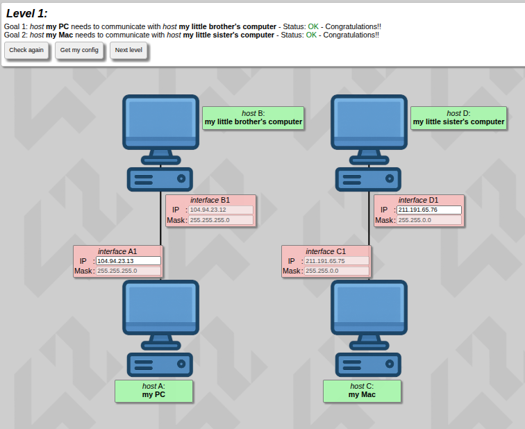
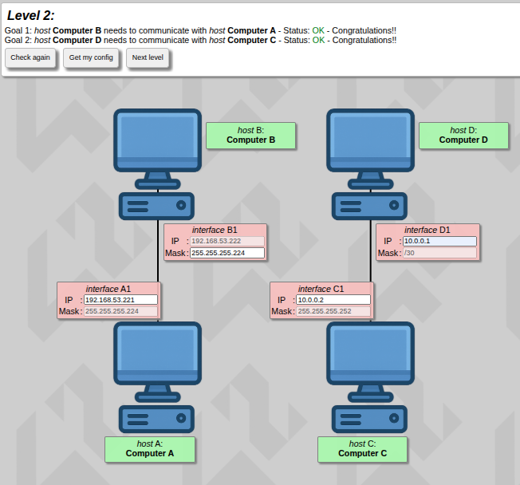
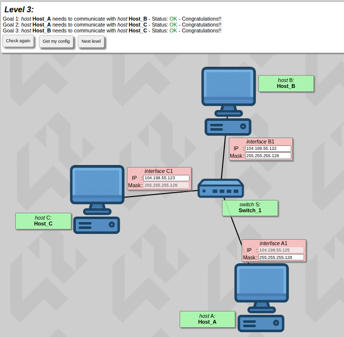
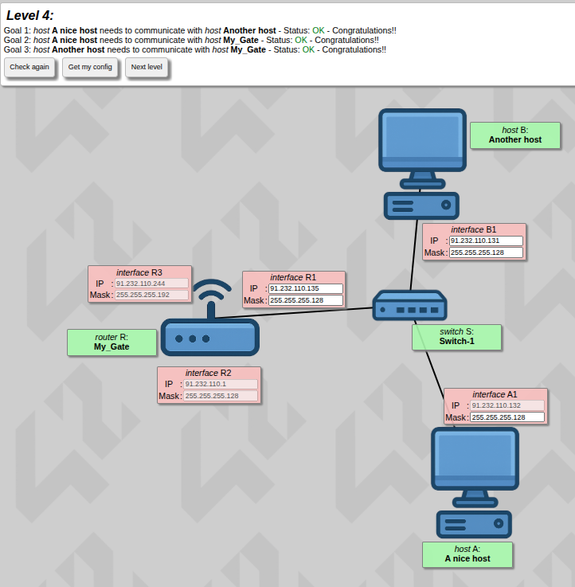
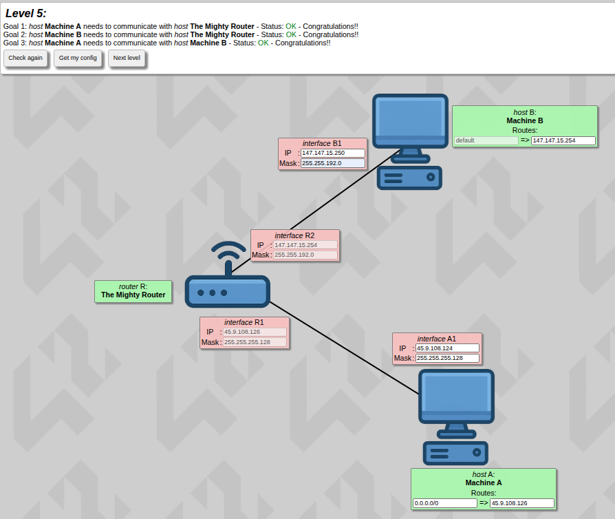
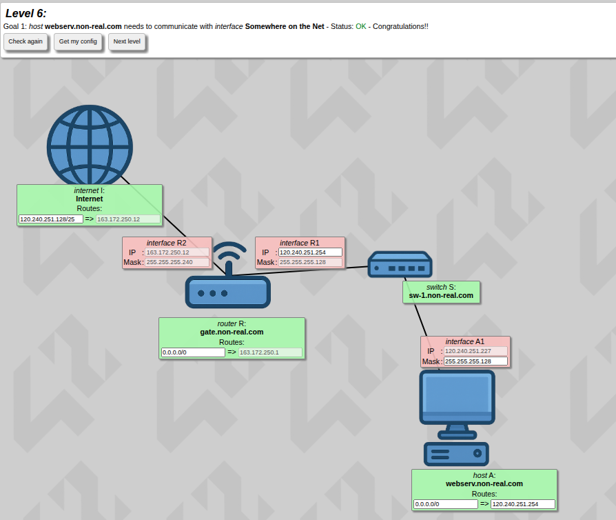
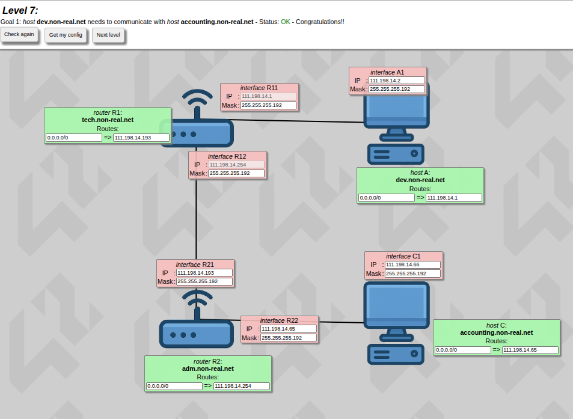
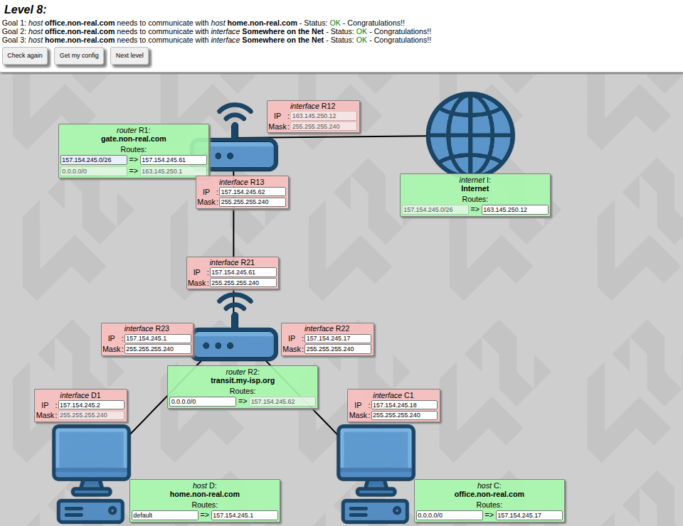
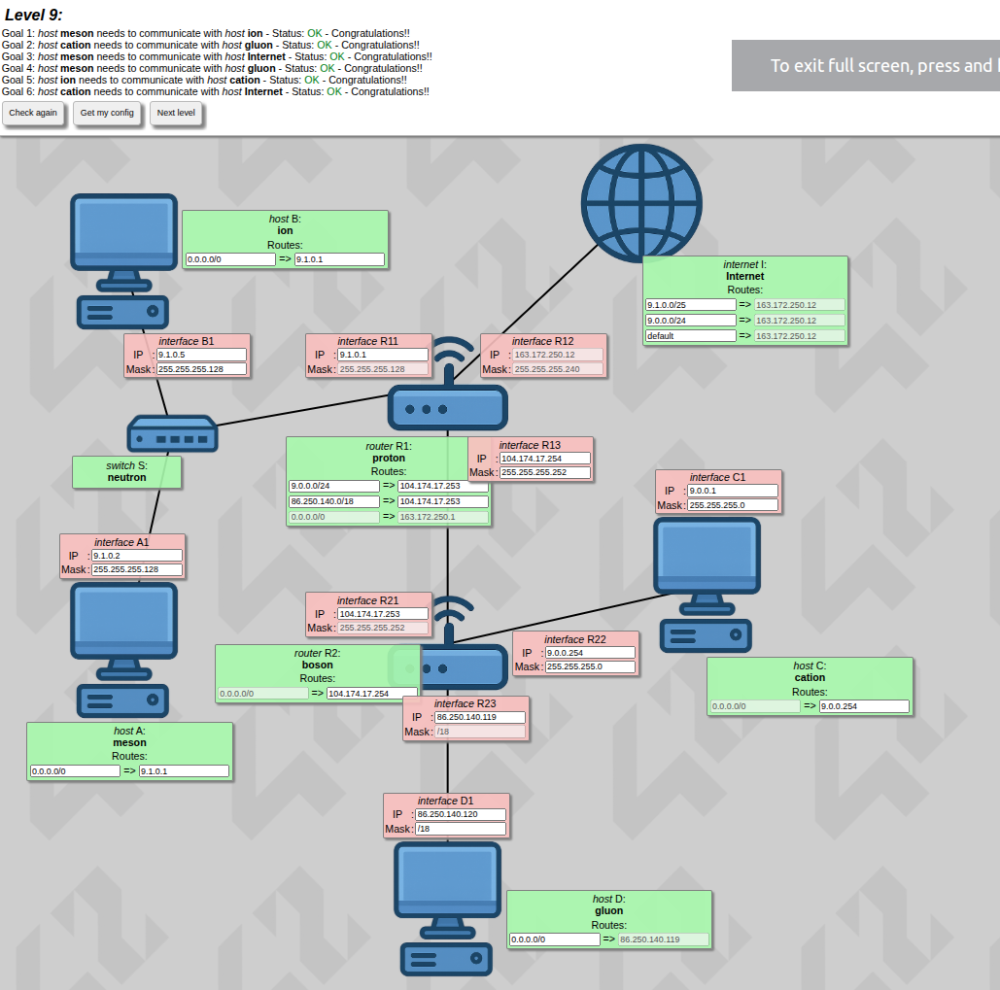
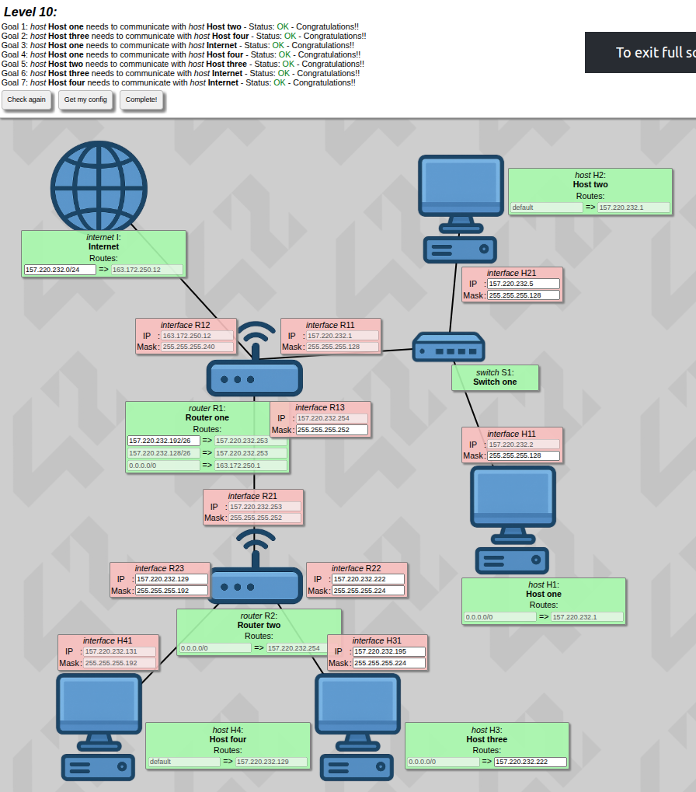

*This project has been created as part of the 42 curriculum by ilnassi.*

# NetPractice
 


## Description

NetPractice is an introductory networking project from the 42 curriculum. The goal is to understand and apply the fundamentals of TCP/IP networking by diagnosing and fixing broken network topologies through a web-based training interface.

Each level presents a diagram of interconnected devices — hosts, routers, and switches — where one or more network parameters (IP addresses, subnet masks, gateways) are missing or incorrectly configured. The objective is to identify the errors and provide the correct values so that every device on the topology can communicate with every other device, respecting the constraints of the network (available address ranges, subnet sizes, routing rules).

The project is purely conceptual: there is no code to write or compile. The challenge lies entirely in correctly reasoning about IP addressing, subnetting, and routing logic.

## Instructions

### Running the training interface

The training interface is provided as a static web application. To launch it locally:

```bash
./run.sh
```

This starts a local server and opens the NetPractice interface in your browser, where the 10 levels can be accessed and solved interactively.

### Solving a level

1. Open the desired level in the interface.
2. Inspect the topology: identify hosts, routers, switches, and the links between them.
3. For each incomplete or incorrect field, determine the correct IP address, subnet mask, and/or gateway based on the constraints shown (available address ranges, number of usable hosts per subnet, existing correct fields on the same network segment).
4. Fill in the fields and use the interface's built-in check to verify the configuration is valid (all devices reachable, no overlapping or invalid subnets).

### Exporting configurations

Once a level is validated as correct:

1. Use the **export** function in the interface to download the configuration file for that level.
2. Save the exported file at the root of this repository, using a clear naming convention (e.g., `level1.json`, `level2.json`, ... `level10.json`).

### Submission requirements

- All **10 levels** must be solved and validated.
- The **10 exported configuration files** (one per level) must be placed at the **root of the repository**.
- The `README.md` must be present at the root, as required by the 42 norm/evaluation guidelines for this project.

## A closer look at each concept

**TCP/IP and IP addresses**

TCP/IP is the set of rules that lets every device on a network — and on the Internet as a whole — find and talk to every other device. The "IP" part (Internet Protocol) is responsible for addressing: it gives each device a unique number, the IP address, so that data knows where to go. The "TCP" part handles making sure the data arrives complete and in order, but for NetPractice the focus is entirely on the IP side: addresses, masks, and routing.

There are two versions of IP in use today:
- **IPv4**: the classic format, four numbers from 0 to 255 separated by dots (e.g. `192.168.1.10`). It's a 32-bit address, which gives about 4.3 billion possible combinations — this is the format used throughout NetPractice.
- **IPv6**: the newer format, written as eight groups of hexadecimal digits (e.g. `2001:0db8::1`). It's 128-bit, created because IPv4 eventually runs out of available addresses. NetPractice doesn't use IPv6, but it's worth knowing it exists and solves the same addressing problem at a much larger scale.

Every IPv4 address is split conceptually into two parts:
- the **network portion**, which identifies which subnet the device belongs to (like a postal code identifying a neighborhood);
- the **host portion**, which identifies the specific device inside that subnet (like a house number inside that neighborhood).

The subnet mask is what tells a device exactly where the line between those two portions falls.

**Subnet masks and CIDR notation**

A subnet mask is a second number, in the same four-number format as an IP address, that "covers" the network portion of the address with `255`s and leaves the host portion as `0`s. For example, `255.255.255.0` means: the first three numbers identify the network, and the last number identifies the host within it — giving room for 254 usable host addresses (256 total, minus the network address and the broadcast address).

**CIDR notation** (e.g. `/24`, `/27`, `/30`) is just a shorter way of writing the same mask, by counting how many bits (out of 32) are dedicated to the network portion:

| CIDR | Subnet mask | Usable hosts |
|------|-------------|--------------|
| /24 | 255.255.255.0 | 254 |
| /25 | 255.255.255.128 | 126 |
| /26 | 255.255.255.192 | 62 |
| /27 | 255.255.255.224 | 30 |
| /28 | 255.255.255.240 | 14 |
| /29 | 255.255.255.248 | 6 |
| /30 | 255.255.255.252 | 2 |

The smaller the host portion, the fewer addresses are available — but the tighter and more efficient the subnet. Inside any subnet, two addresses are always reserved and can't be assigned to a device: the **network address** (all host bits at 0, identifies the subnet itself) and the **broadcast address** (all host bits at 1, used to reach every device in that subnet at once).

**Subnetting**

Subnetting is the act of taking one network and splitting it into smaller, self-contained pieces — each with its own range of addresses — to match how many devices actually need to fit in each piece. A link with only two devices (like a router-to-router connection) doesn't need the same space as a LAN with dozens of hosts, so using a `/30` for the first and a `/24` for the second avoids wasting addresses.

The practical method I used while solving each level:
1. Count how many hosts need to fit in that specific segment (including router interfaces on that segment).
2. Pick the smallest mask that comfortably covers that number (using the CIDR table above).
3. Make sure every device on the *same* wire/switch shares that exact network address and mask.
4. Make sure devices on *different* sides of a router use *different* subnets — otherwise the router has nothing to route between.

**Default gateways**

A default gateway is the address a device sends traffic to whenever the destination isn't inside its own subnet. It's effectively the device saying "I don't know how to reach this address directly, so I'll hand it to my router and let it figure out the rest." Every host pointed its default route (`0.0.0.0/0` or `default`) at the router interface sitting on its own local subnet — never at a router interface on a different subnet, since that wouldn't be directly reachable.

**Routers and switches**

These two devices look similar but do very different jobs:
- A **switch** connects multiple devices *within the same subnet*. It works at a lower level and simply forwards data between ports without caring about IP addresses or different networks — every device plugged into the same switch must share the same subnet.
- A **router** connects *different* subnets together. Each of its interfaces sits in a different network, and its job is to decide, based on the destination IP address, which interface to forward a packet out of in order to get it closer to its destination.

In short: switches *extend* one network, routers *connect* multiple networks.

**OSI model layers**

The OSI model describes networking in stacked layers. NetPractice mainly touches two of them:
- **Layer 2 (Data Link)**: this is where switches operate — moving data between devices on the same local network without any awareness of IP addressing.
- **Layer 3 (Network)**: this is where routers and IP addressing live — deciding how to get a packet from one network to another based on its destination address.

Understanding which layer a device works at explains why switches need no IP configuration to forward traffic, while routers need a correctly configured IP and mask on every interface.

**Routing logic**

Whenever a device needs to send data, it runs through the same basic logic:
1. Compare the destination IP address against its own IP and subnet mask.
2. If the destination falls inside the same subnet → send the data directly on the local network (no router involved).
3. If the destination falls outside the local subnet → forward the data to the configured default gateway, which repeats the same check on its own interfaces, and so on, hop by hop, until the data reaches a router that *is* directly connected to the destination's subnet.

This is exactly the logic used to validate each level: tracing, interface by interface, whether a packet starting at one host could reach its goal by following this same local-or-gateway decision at every hop.

## Levels

Each level below can be expanded to see the original topology, the reasoning used to solve it, and the final configuration values applied.

<details>
<summary><strong>Level 1</strong></summary>



**Explanation:**

The simplest topology: two independent point-to-point links, each connecting a single PC directly to another machine through one interface pair. There is no router and no shared network — each link is its own isolated /24 subnet, so the only requirement is that both interfaces on the same cable share the same network address and mask. I picked two non-overlapping /24 ranges for the two unrelated links and made sure each pair of interfaces sat in the same subnet.

**Configuration used:**

| Device | IP address | Subnet mask |
|--------|-----------|-------------|
| Interface A1 (my PC) | 104.94.23.13 | 255.255.255.0 |
| Interface B1 (little brother's computer) | 104.94.23.12 | 255.255.255.0 |
| Interface C1 (my Mac) | 211.191.65.75 | 255.255.0.0 |
| Interface D1 (little sister's computer) | 211.191.65.76 | 255.255.0.0 |

</details>

<details>
<summary><strong>Level 2</strong></summary>



**Explanation:**

Two separate point-to-point links again, but here the subnet sizes had to be chosen deliberately. The A–B link only needs 2 usable host addresses, so a `/27` (255.255.255.224, 30 usable hosts — oversized here, just needs to cover both ends) works for B1/A1. The C–D link is even smaller and only needs 2 hosts, so I used a `/30` (255.255.255.252, exactly 2 usable addresses) — the tightest mask that still fits both interfaces.

**Configuration used:**

| Device | IP address | Subnet mask |
|--------|-----------|-------------|
| Interface A1 (Computer A) | 192.168.53.221 | 255.255.255.224 |
| Interface B1 (Computer B) | 192.168.53.222 | 255.255.255.224 |
| Interface C1 (Computer C) | 10.0.0.2 | 255.255.255.252 |
| Interface D1 (Computer D) | 10.0.0.1 | 255.255.255.252 |

</details>

<details>
<summary><strong>Level 3</strong></summary>



**Explanation:**

First topology with a switch: Host_A, Host_B, and Host_C all connect to the same Switch_1, meaning all three interfaces (A1, B1, C1) must belong to the **same subnet** since a switch operates at Layer 2 and does not separate broadcast domains. I assigned three consecutive addresses within one `/25` range (255.255.255.128) so all three hosts can see each other directly without needing a router.

**Configuration used:**

| Device | IP address | Subnet mask |
|--------|-----------|-------------|
| Interface A1 (Host_A) | 104.198.55.125 | 255.255.255.128 |
| Interface B1 (Host_B) | 104.198.55.122 | 255.255.255.128 |
| Interface C1 (Host_C) | 104.198.55.123 | 255.255.255.128 |

</details>

<details>
<summary><strong>Level 4</strong></summary>



**Explanation:**

First level with a router (My_Gate). Host A connects through Switch-1 to interface R1 on the router, while Host B connects directly to interface R1's segment too — both A1 and B1 share the same subnet as R1 (`/25`, 255.255.255.128). Interface R3 is a **separate** subnet (255.255.255.192) on the router's other side, simulating "the wider net" the router bridges to. Since A and B are on the same LAN as R1, they communicate directly without needing the router for goal 3, but R1 still needed a correct IP/mask to satisfy goals 1 and 2 (reaching "My_Gate" itself).

**Configuration used:**

| Device | IP address | Subnet mask |
|--------|-----------|-------------|
| Interface A1 (A nice host) | 91.232.110.132 | 255.255.255.128 |
| Interface B1 (Another host) | 91.232.110.131 | 255.255.255.128 |
| Interface R1 (router, LAN side) | 91.232.110.135 | 255.255.255.128 |
| Interface R2 (router, internal) | 91.232.110.1 | 255.255.255.128 |
| Interface R3 (router, other side) | 91.232.110.244 | 255.255.255.192 |

</details>

<details>
<summary><strong>Level 5</strong></summary>



**Explanation:**

A router ("The Mighty Router") sits between two separate subnets: Machine A on one side (with interface R1) and Machine B on the other (with interface R2). The two router interfaces R1/R2 must each match the subnet of the host on their respective side — R1 shares a `/25` (255.255.255.128) with Machine A, while R2 shares a `/18` (255.255.192.0) with Machine B. Each host's default route points to its local router interface, letting the router forward traffic between the two distinct networks.

**Configuration used:**

| Device | IP address | Subnet mask |
|--------|-----------|-------------|
| Interface A1 (Machine A) | 45.9.108.124 | 255.255.255.128 |
| Interface R1 (router, A side) | 45.9.108.126 | 255.255.255.128 |
| Interface R2 (router, B side) | 147.147.15.254 | 255.255.192.0 |
| Interface B1 (Machine B) | 147.147.15.250 | 255.255.192.0 |

</details>

<details>
<summary><strong>Level 6</strong></summary>



**Explanation:**

First level reaching "Somewhere on the Net" — the Internet block itself. Host A connects via switch `sw-1.non-real.com` to router interface R1, which shares Host A's `/25` subnet (255.255.255.128). On the other side, router interface R2 sits in the same `/27` range (255.255.255.224) as the Internet block's advertised network, so router R can forward Host A's traffic out to the Internet through gateway 163.172.250.12.

**Configuration used:**

| Device | IP address | Subnet mask |
|--------|-----------|-------------|
| Interface A1 (Host A) | 120.240.251.227 | 255.255.255.128 |
| Interface R1 (router, LAN side) | 120.240.251.254 | 255.255.255.128 |
| Interface R2 (router, Internet side) | 163.172.250.12 | 255.255.255.224 |
| Internet (advertised route) | 120.240.251.128/25 | → 163.172.250.12 |

</details>

<details>
<summary><strong>Level 7</strong></summary>



**Explanation:**

A chain of two routers (R1 "tech.non-real.net" and R2 "adm.non-real.net") connecting two hosts on opposite ends. Host A and interface A1 share R1's LAN-side subnet (`/26`, 255.255.255.192), and Host C / interface C1 share R2's LAN-side subnet (same `/26`). The two routers are linked to each other through R12–R21, which form their own dedicated `/26` transit subnet. Each router's default route (0.0.0.0/0) points toward the other router, so traffic from A reaches C by hopping R1 → R2.

**Configuration used:**

| Device | IP address | Subnet mask |
|--------|-----------|-------------|
| Interface A1 (dev.non-real.net) | 111.198.14.2 | 255.255.255.192 |
| Interface R11 (router 1, LAN side) | 111.198.14.1 | 255.255.255.192 |
| Interface R12 (router 1, transit) | 111.198.14.254 | 255.255.255.192 |
| Interface R21 (router 2, transit) | 111.198.14.193 | 255.255.255.192 |
| Interface R22 (router 2, LAN side) | 111.198.14.65 | 255.255.255.192 |
| Interface C1 (accounting.non-real.net) | 111.198.14.66 | 255.255.255.192 |

</details>

<details>
<summary><strong>Level 8</strong></summary>



**Explanation:**

Two routers (R1 "gate.non-real.com" and R2 "transit.my-isp.org") chained together, with R1 also bridging out to the Internet block. R1's interfaces R12 (Internet side) and R13/R21 (transit toward R2) each sit in their own `/28` subnets (255.255.255.240). R2 then connects to hosts D and C through R23/R22, again in a `/28`. Routes were set hop-by-hop: R1's default route points to the Internet gateway, R2's default route points back to R1, and each host's default route points to its local router interface.

**Configuration used:**

| Device | IP address | Subnet mask |
|--------|-----------|-------------|
| Interface R12 (R1, Internet side) | 163.145.250.12 | 255.255.255.240 |
| Interface R13 (R1, transit) | 157.154.245.62 | 255.255.255.240 |
| Interface R21 (R2, transit) | 157.154.245.61 | 255.255.255.240 |
| Interface R23 (R2, D side) | 157.154.245.1 | 255.255.255.240 |
| Interface R22 (R2, C side) | 157.154.245.17 | 255.255.255.240 |
| Interface D1 (home.non-real.com) | 157.154.245.2 | 255.255.255.240 |
| Interface C1 (office.non-real.com) | 157.154.245.18 | 255.255.255.240 |

</details>

<details>
<summary><strong>Level 9</strong></summary>



**Explanation:**

A more complex topology with two routers (R1 "proton" and R2 "boson") each serving two LANs, plus an Internet block. Router R1 handles the "ion"/"meson" subnet (`/25`, 255.255.255.128) on one side and a wireless transit link to R2 on the other. Router R2 handles "cation" (`/27`, 255.255.255.224) and "gluon" (using a `/18` mask, 255.255.192.0) on its sides, plus the same wireless transit subnet shared with R1. Static routes were added on R1 and R2 so each router knows how to reach the networks it doesn't directly touch (e.g. R1 has explicit routes to 9.0.0.0/24 and 86.250.140.0/18 via R2), while the default route on R1 points out to the Internet gateway.

**Configuration used:**

| Device | IP address | Subnet mask |
|--------|-----------|-------------|
| Interface B1 (ion) | 9.1.0.5 | 255.255.255.128 |
| Interface R11 (R1, ion side) | 9.1.0.1 | 255.255.255.128 |
| Interface R12 (R1, Internet side) | 163.172.250.12 | 255.255.255.240 |
| Interface R13 (R1, transit to R2) | 104.174.17.254 | 255.255.255.252 |
| Interface A1 (meson) | 9.1.0.2 | 255.255.255.128 |
| Interface R21 (R2, transit to R1) | 104.174.17.253 | 255.255.255.252 |
| Interface R22 (R2, cation side) | 9.0.0.254 | 255.255.255.0 |
| Interface R23 (R2, gluon side) | 86.250.140.119 | 255.255.192.0 |
| Interface C1 (cation) | 9.0.0.1 | 255.255.255.0 |
| Interface D1 (gluon) | 86.250.140.120 | 255.255.192.0 |

</details>

<details>
<summary><strong>Level 10</strong></summary>



**Explanation:**

The most complex topology of the project: two routers (R1 and R2) each managing two switch-connected LANs, with R1 also bridging to the Internet block. Each router LAN segment (R11/H11, R12/Internet, R21–R23 transit, R22/H31, R23/H41) needed a carefully sized mask matching the number of hosts on that segment — ranging from `/25` (255.255.255.128) for the larger host LANs down to `/27`/`/28`-style tighter masks for transit and point-to-point links. Static routes were configured on both routers so each knows the path to networks beyond its directly attached interfaces, and the Internet block's route points back into R1's external interface.

**Configuration used:**

| Device | IP address | Subnet mask |
|--------|-----------|-------------|
| Interface H21 (Host two) | 157.220.232.5 | 255.255.255.128 |
| Interface H11 (Host one) | 157.220.232.2 | 255.255.255.128 |
| Interface R11 (R1, switch side) | 157.220.232.1 | 255.255.255.128 |
| Interface R12 (R1, Internet side) | 163.172.250.12 | 255.255.255.240 |
| Interface R13 (R1, transit to R2) | 157.220.232.254 | 255.255.255.252 |
| Interface R21 (R2, transit to R1) | 157.220.232.253 | 255.255.255.252 |
| Interface R23 (R2, H41 side) | 157.220.232.129 | 255.255.255.192 |
| Interface R22 (R2, H31 side) | 157.220.232.222 | 255.255.255.224 |
| Interface H41 (Host four) | 157.220.232.131 | 255.255.255.192 |
| Interface H31 (Host three) | 157.220.232.195 | 255.255.255.224 |

</details>

## Resources

### Networking concepts studied

- **TCP/IP addressing**: IPv4 address structure, network vs. host portions
- **Subnet masks and CIDR notation**: calculating subnet ranges, usable host addresses, broadcast and network addresses
- **Subnetting**: splitting and sizing networks according to host count requirements
- **Default gateways**: their role in routing traffic outside the local subnet
- **Routers and switches**: differences in function, how routers interconnect distinct networks while switches operate within a single network segment
- **OSI model layers**: focus on Layer 2 (Data Link, switching) and Layer 3 (Network, IP routing)
- **Routing logic**: how devices determine whether a destination is local or must be forwarded through a gateway

### Documentation and references

- [RFC 791 – Internet Protocol](https://www.rfc-editor.org/rfc/rfc791) — original IP specification
- [RFC 950 – Internet Standard Subnetting Procedure](https://www.rfc-editor.org/rfc/rfc950)
- [Cisco – What is Subnetting?](https://www.cisco.com/c/en/us/solutions/small-business/resource-center/networking/network-subnetting.html)
- [Cloudflare Learning – What is a subnet?](https://www.cloudflare.com/learning/network-layer/what-is-a-subnet/)
- [Practical Networking – Subnetting articles](https://www.practicalnetworking.net/series/subnetting/subnetting-1/)

### AI usage disclosure

AI (Claude, Anthropic) was used during this project as a **study and explanation aid**, not to solve levels directly:

- Building intuition for subnetting using analogies (e.g., comparing IP/subnet structure to neighborhoods and street addresses) to better understand how network and host portions of an address relate.
- Reviewing CIDR notation and practicing converting between subnet masks, prefix lengths, and usable host ranges.
- Preparing a personal cheat sheet (CIDR reference table, step-by-step method for solving a level, and talking points for the peer-evaluation defense) to consolidate understanding before attempting and defending the levels.
- Clarifying the conceptual difference between routers and switches and the role of the default gateway when working through topologies that mixed both.

All 10 levels were solved and validated independently by reasoning through each topology's constraints.
